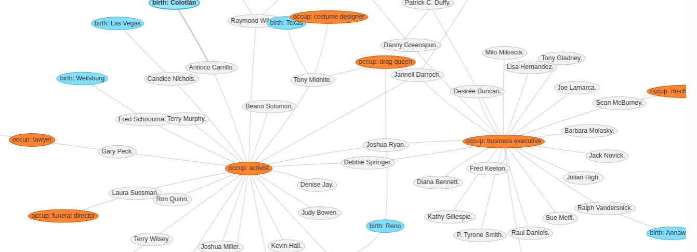
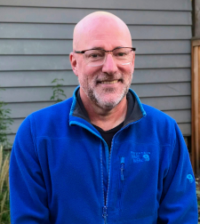

Andre Hulet Library & Information Science Portfolio
 

## About Me

I am a metadata librarian and programmer, and I focus on digital 
collection development. This site contains a concise portfolio of my 
work in library and information science. My thanks goes out to the 
people with whom I've worked on these examples.

## Collections and the Public Good

With the advent of machine learning and large language models (AI), 
it is tempting to worry that people will simply "consult the oracle" 
rather than do the harder work of educating themselves at libraries 
and archives. But of course, like commercial search engines before 
them, AI tools are really recycling content created by educated people. 
Consequently, well organized and described collections remain 
foundational for both education and all types of knowledge creation.

## DEI As a Core Value in Metadata Development

Our society continues to wrongly marginalize many of its own 
communities, and we are all subject to the prejudiced mentalities 
that ultimately exclude and oppress racial, ethnic, and religious 
groups, sexual minorities, and women, among others. In order to 
resist these tendencies in myself, I actively collaborate and 
cultivate my awareness of who I am working with, thinking about, 
and providing service to. Over time, my own work describing library 
and archival resources should show a record of inclusion and equity 
for marginalized communities. This is clearly the right thing to do: 
it drives accuracy, invites more participation in our democracy, 
and addresses the difficulties faced by many of our fellow citizens.

## Improving Search and Discovery

Keyword search is the foundation of search architecture, but search 
tools should also let users incorporate structured metadata into 
their queries via subject facets, date ranges, geography, and so forth. 
This is the basis for locating harder-to-find materials that are highly 
relevant. In my system development work, I look for strategies to 
enrich resource descriptions as much as possible, addressing both the 
standard and unique aspects of a resource. The search tools should in 
turn exploit that richness, allowing users to quickly assess the 
relevance of search results and see meaningful connections to related 
resources. To this end, metadata are best staged and accessed as linked 
open data, which let users visualize and relate things automatically. 
A searcher should be able to, for instance, find a special collection a
bout airplanes at a library, and immediately discover another relevant 
resource at a distant archives because both collections share a 
subject category, like "airplane fuselage design." Investing in linked 
data will make such occurrences more frequent over time.
